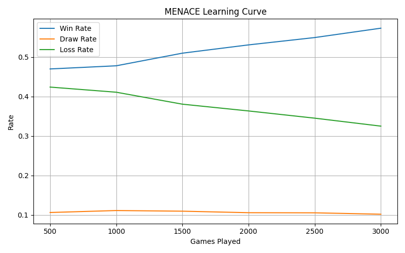

# MENACE: Matchbox Educable Noughts And Crosses Engine 🎲❌⭕  

A Python reimplementation of Donald Michie’s **MENACE (1960s)** — a physical matchbox machine that learned Tic-Tac-Toe using beads.



---

## ✨ Features
- MENACE agent with reinforcement learning (bead adjustment).
- Symmetry reduction (rotations/reflections).
- Training loop + visualization of win/draw/loss rates.
- Play interactively vs MENACE in the terminal.
- Unit tests included.

---

## 🚀 Getting Started
```bash
git clone https://github.com/Morgan971-pixel/menace-tictactoe.git
cd menace-tictactoe
pip install -e .
```

## Usage

To train MENACE and see the learning curve:
```bash
menace-train
```

To play an interactive game against a trained MENACE in your terminal:
```bash
menace-play
```

## Historical Background

MENACE was originally created by **Donald Michie** in 1961 at Edinburgh University. Using 304 matchboxes and colored beads, Michie demonstrated that machine learning was possible without computers, decades before modern AI algorithms became practical.

### Key Historical Facts:
- **Inventor**: Donald Michie (1923-2007), British AI pioneer
- **Year**: 1961
- **Method**: 304 physical matchboxes containing colored beads
- **Learning**: Reinforcement through bead adjustment based on game outcomes
- **Impact**: Demonstrated feasibility of machine learning concepts

## References and Further Reading

### Original Work
- **Michie, D.** (1961). "Trial and Error". *Science Survey*, Part 2, pp. 129-145. Penguin Books.
- **Michie, D.** (1963). "Experiments on the mechanization of game-learning part I. Characterization of the model and its parameters". *The Computer Journal*, 6(3), 232-236.

### Historical Context
- **Gardner, M.** (1962). "Mathematical Games: How to build a game-learning machine and then teach it to play and win". *Scientific American*, 206(4), 138-151.
- **Sutton, R. S., & Barto, A. G.** (2018). *Reinforcement Learning: An Introduction* (2nd ed.). MIT Press. [Chapter 1 discusses MENACE's historical significance]

### Online Resources
- [Donald Michie - Wikipedia](https://en.wikipedia.org/wiki/Donald_Michie)
- [MENACE (MSCROGGS) - Play with more settings](https://www.mscroggs.co.uk/menace/)
- [Computerphile: MENACE Video](https://www.youtube.com/watch?v=R9c-_neaxeU) - Excellent visual explanation

## Attribution

This implementation pays tribute to Donald Michie's groundbreaking work in machine learning. While modernized for Python, it faithfully recreates the core algorithm that demonstrated machine learning was possible using simple physical components.

**Citation**: If you use this implementation, please cite both this repository and Michie's original work:
