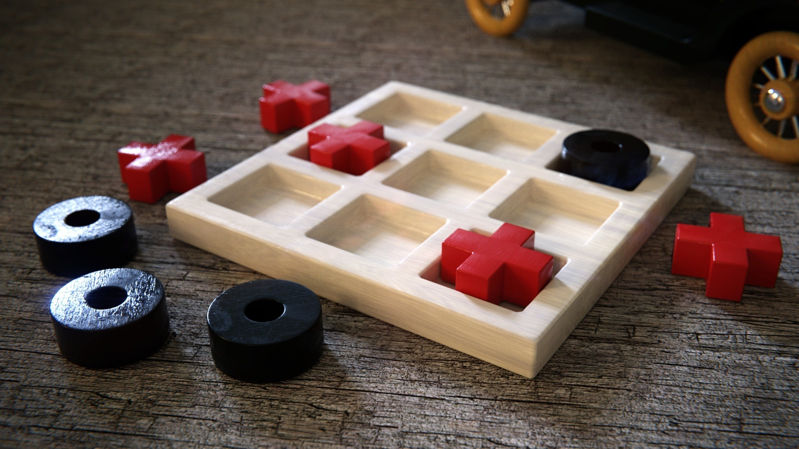
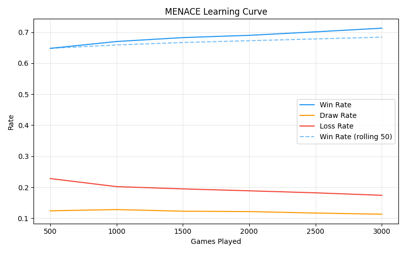

# MENACE: Matchbox Educable Noughts and Crosses Engine

MENACE is a tic-tac-toe playing machine that learns through reinforcement. It was devised by Donald Michie in 1961 using 304 matchboxes and coloured beads, long before this kind of learning was practical on computers. This repository is a Python reimplementation that trains a MENACE agent, lets it play against random or perfect opponents, and supports interactive play against a human.



## Features

- Reinforcement learning agent driven by a bead-counting mechanism.
- Symmetry reduction over rotations and reflections to shrink the state space.
- Random and perfect (minimax) opponents for training and evaluation.
- Standard training, MENACE vs MENACE self-play, and play against a perfect opponent.
- Save and load trained agents as portable JSON.
- Training progress bar and a configurable learning-curve plot.
- Command-line entry points and a small Python API.
- Unit tests.

## Installation

```bash
git clone https://github.com/Morgan971-pixel/menace-tictactoe.git
cd menace-tictactoe
pip install -e .
```

Install the test extras with:

```bash
pip install -e ".[test]"
```

## Usage

Train MENACE and view the learning curve:

```bash
menace-train --games 5000 --report-every 500 --save trained.json
```

`menace-train` arguments:

- `--games` (int, default 5000): number of training games.
- `--report-every` (int, default 500): report interval in games.
- `--save` (str, optional): path to save the trained MENACE as JSON.
- `--no-plot`: skip showing the plot (plotting is on by default).

Play against MENACE in the terminal:

```bash
menace-play --load trained.json --no-learn
```

`menace-play` arguments:

- `--games` (int, default 1000): training games to run when no agent is loaded.
- `--load` (str, optional): path to a saved MENACE JSON to load instead of training.
- `--no-learn`: do not update MENACE beads during the play session.

Python API:

```python
from menace import MENACE, train_menace

menace, stats = train_menace(n_games=5000, report_every=500)
menace.save("trained.json")

fresh = MENACE()
fresh.load("trained.json")

move, log = fresh.choose_move([" "] * 9)
```

## Training Output

Running `menace-train --games 3000 --report-every 500` produces output like the following. Win rate climbs steadily as MENACE reinforces successful strategies and discards losing ones.

```
  500 games | win 0.622  draw 0.122  loss 0.256
 1000 games | win 0.654  draw 0.111  loss 0.235
 1500 games | win 0.679  draw 0.113  loss 0.207
 2000 games | win 0.690  draw 0.114  loss 0.196
 2500 games | win 0.707  draw 0.110  loss 0.184
 3000 games | win 0.724  draw 0.107  loss 0.168

Matchboxes learned: 335
```

MENACE converges to winning roughly 72% of games against a random opponent after 3000 training games, using only 335 canonical board positions (out of a theoretical maximum of 5478, reduced via symmetry).



## Training Modes

### Standard training (vs random)

`train_menace(n_games, report_every)` plays MENACE as X against a random opponent and reinforces moves after each game. This is the default mode used by `menace-train`.

### Self-play

`train_menace_selfplay(n_games, report_every)` trains two agents against each other. `menace_x` always plays X and `menace_o` always plays O. After each game both are updated, with O's reward taken from O's perspective. It returns `(menace_x, menace_o, stats)`.

### Vs perfect opponent

Pass the minimax opponent to `train_menace` to train against optimal play:

```python
from menace import train_menace, perfect_opponent_move

menace, stats = train_menace(n_games=5000, opponent=perfect_opponent_move)
```

A perfect opponent never loses, so MENACE converges toward drawing rather than winning.

## How It Works

Each board position MENACE can face is represented by a matchbox holding beads, one colour per legal move. To move, MENACE draws a bead at random, so moves with more beads are more likely. After a game it adjusts the beads: winning moves gain beads, drawing moves gain fewer, and losing moves lose beads down to a floor of one. Symmetry reduction maps each board to a canonical form across the eight rotations and reflections, so strategically equivalent positions share a single matchbox and learning converges faster.

## Historical Background

MENACE was created by Donald Michie (1923-2007) at Edinburgh University in 1961. Using 304 matchboxes filled with coloured beads, Michie showed that a machine could learn to play noughts and crosses through trial and error without a computer, anticipating modern reinforcement learning.

References:

- Michie, D. (1961). "Trial and Error". Science Survey, Part 2, pp. 129-145. Penguin Books.
- Michie, D. (1963). "Experiments on the mechanization of game-learning part I". The Computer Journal, 6(3), 232-236.
- Gardner, M. (1962). "Mathematical Games". Scientific American, 206(4), 138-151.
- Sutton, R. S., and Barto, A. G. (2018). Reinforcement Learning: An Introduction (2nd ed.). MIT Press.
- Donald Michie, Wikipedia: https://en.wikipedia.org/wiki/Donald_Michie
- MENACE by mscroggs: https://www.mscroggs.co.uk/menace/
- Computerphile MENACE video: https://www.youtube.com/watch?v=R9c-_neaxeU

## License

Released under the terms in the LICENSE file.
